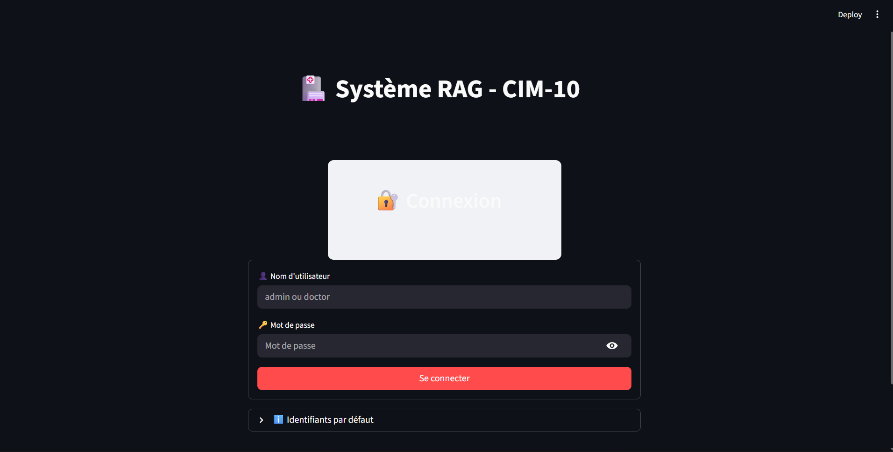
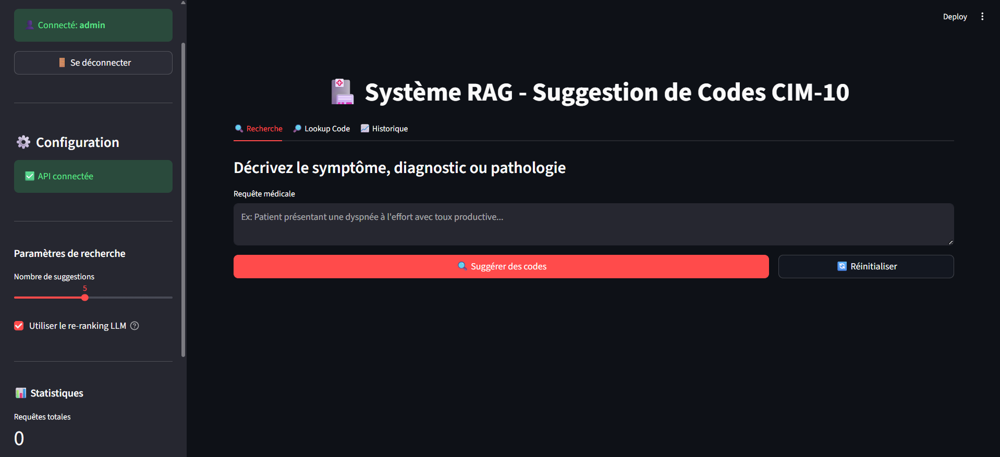
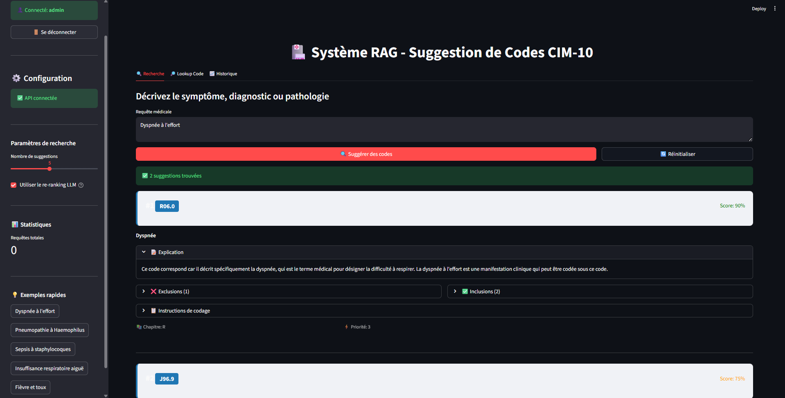
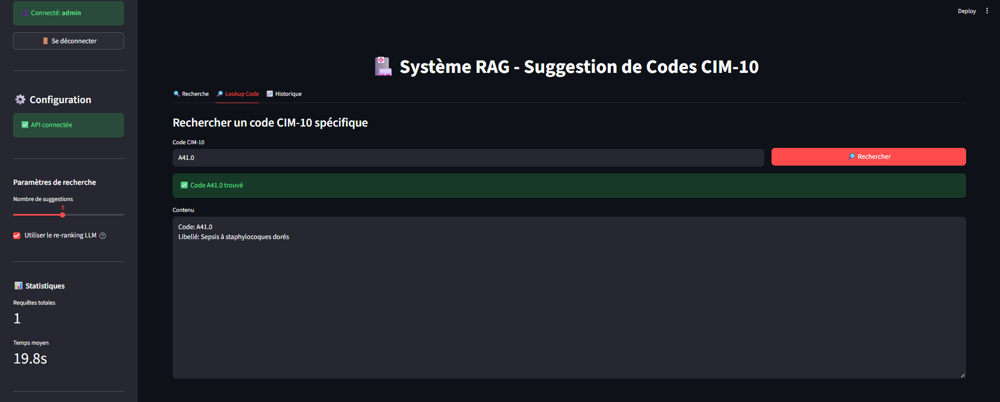
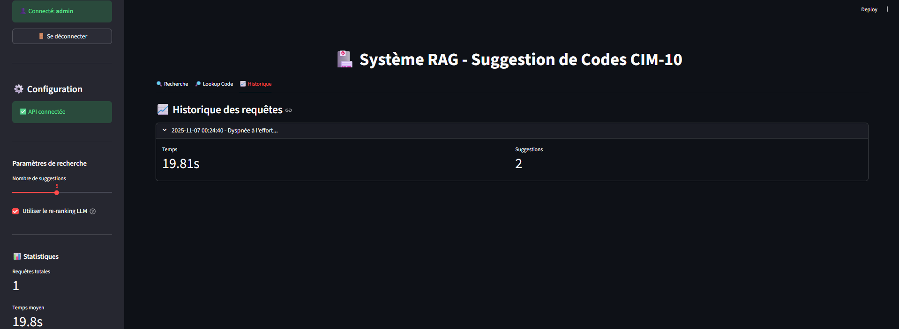

# Application Screenshots

Visual walkthrough of the Medical RAG system.

---

## 1. Login Screen

Simple authentication with username/password. Default credentials (for local DEV only):
- Admin: `admin` / `admin123`
- Doctor: `doctor` / `doctor123`

---

## 2. Main Dashboard

Interface with:
- Query input field
- Number of suggestions selector (To be improved)
- Re-ranking toggle
- Submit button
- ...

---

## 3. Query Input Example

Example query: "Dyspnée à l'effort avec toux"

Each suggestion shows:
- CIM-10 code (e.g., R06.0)
- Label/description
- Relevance score (0-1)
- Clinical explanation
- Exclusions and Inclusions (If any)
- CoCoA rules section

Results ordered by relevance.
---

## 4. Code Lookup

Possibility to look up a specific code through the app.

---
## 5. History of the queries

[← Back to main README](../README.md)